### Olá! 👋

  

---

### Sobre mim

Sou Desenvolvedor .NET e estudante de Ciência da Computação, com foco no desenvolvimento de aplicações backend, APIs REST e soluções multiplataforma. Atualmente trabalho com desenvolvimento de sistemas e suporte técnico na Secretaria de Segurança Pública do Estado do Amazonas (SSP-AM), participando do desenvolvimento e evolução de aplicações corporativas Web, Mobile e backend. 

Tenho direcionado meus estudos e projetos principalmente para o ecossistema .NET, buscando evoluir em arquitetura de software, qualidade de código e construção de aplicações bem estruturadas e escaláveis.

---

### Tecnologias

  

  

  

---

### Contato

  
  

  

